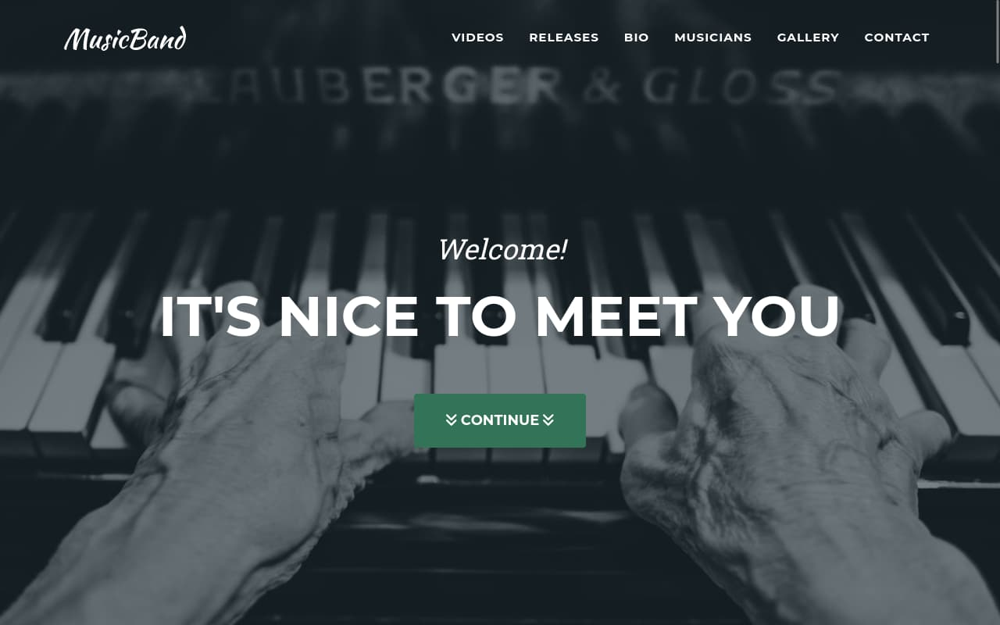

# MusicBand-React

This is a React implementation of [MusicBand](https://github.com/rolodoom/musicband) one page, musician page theme built with [Bootstrap](https://getbootstrap.com/) and forked from [Agency](https://startbootstrap.com/theme/agency) by [Start Bootstrap](https://startbootstrap.com/).

## Preview

## Status

## Usage

Clone the source files of the theme and navigate into the theme's root directory. Run `npm install` and then run `npm start` which will open up a preview of the template in your default browser, watch for changes to core template files, and live reload the browser when changes are saved. You can view the `package.json` file to see which scripts are included.

## Available Scripts

You must have npm installed in order to use this build environment.

### `npm start`

Runs the app in the development mode.\
Open [http://localhost:3000](http://localhost:3000) to view it in your browser.

The page will reload when you make changes.\
You may also see any lint errors in the console.

### `npm test`

Launches the test runner in the interactive watch mode.\
See the section about [running tests](https://facebook.github.io/create-react-app/docs/running-tests) for more information.

### `npm run build`

Builds the app for production to the `build` folder.\
It correctly bundles React in production mode and optimizes the build for the best performance.

The build is minified and the filenames include the hashes.\
Your app is ready to be deployed!

See the section about [deployment](https://facebook.github.io/create-react-app/docs/deployment) for more information.

### `npm run eject`

**Note: this is a one-way operation. Once you `eject`, you can't go back!**

If you aren't satisfied with the build tool and configuration choices, you can `eject` at any time. This command will remove the single build dependency from your project.

Instead, it will copy all the configuration files and the transitive dependencies (webpack, Babel, ESLint, etc) right into your project so you have full control over them. All of the commands except `eject` will still work, but they will point to the copied scripts so you can tweak them. At this point you're on your own.

You don't have to ever use `eject`. The curated feature set is suitable for small and middle deployments, and you shouldn't feel obligated to use this feature. However we understand that this tool wouldn't be useful if you couldn't customize it when you are ready for it.

## Bugs and Issues

Have a bug or an issue with this template? [Open a new issue](https://github.com/rolodoom/musicband-react/issues) here on GitHub.

## About

- Images generated by [Lorem Picsum](https://picsum.photos/) from [Unsplash](https://unsplash.com/) except on the Team Section.
- CD Cover Designs made on [Canva](https://canva.com).
- Here is the [list of images](src/IMAGES.md) used in this project.

## License

This code is released under the [GPL-3.0](https://github.com/rolodoom/musicband-react/blob/master/LICENSE) license, which means you have the four freedoms to run, study, share, and modify the software. Any derivative work must be distributed under the same or equivalent license terms.
